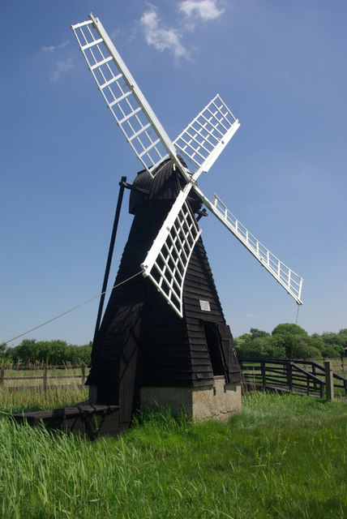
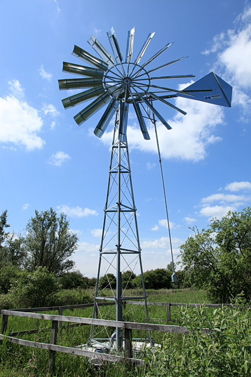
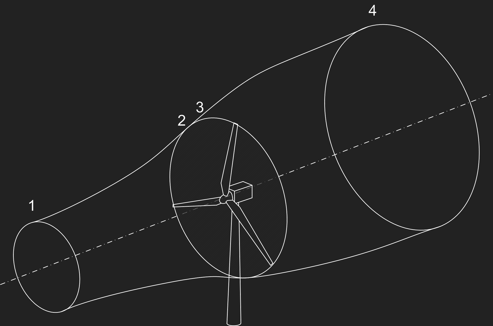
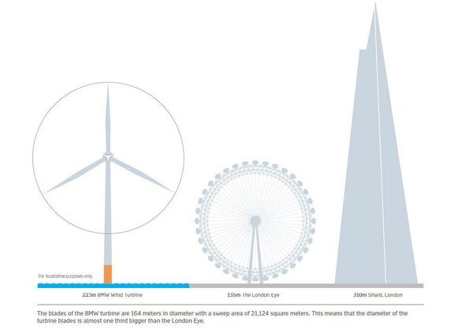
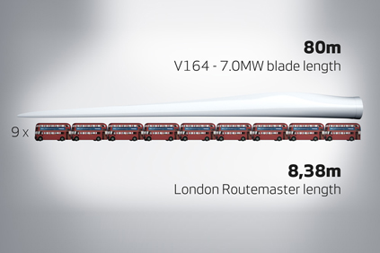
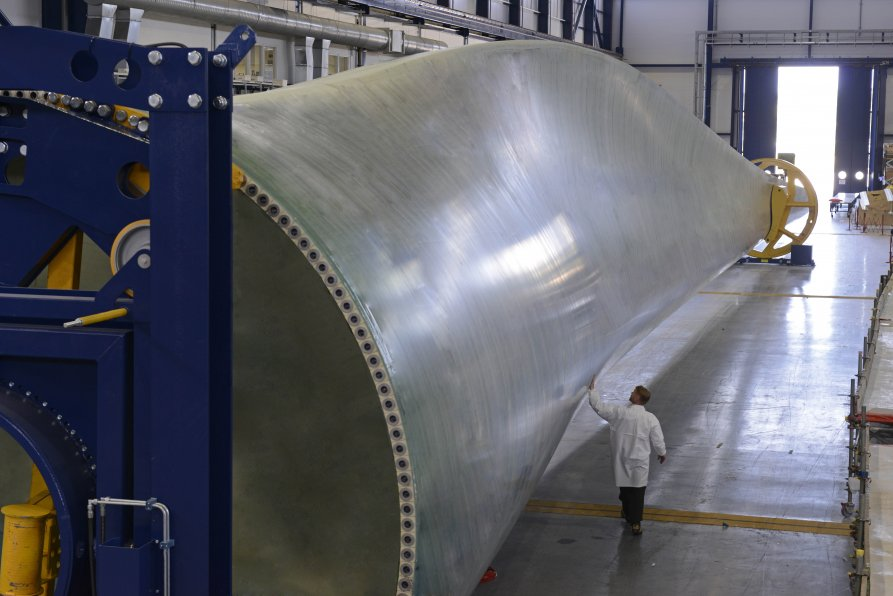
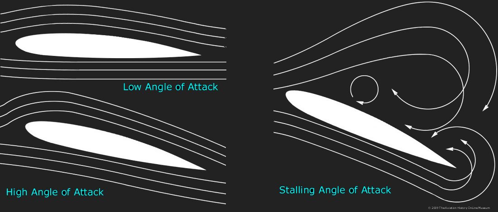
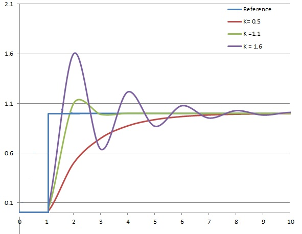

## {data-background="hywind_farm.jpg"}

{.unstyled style="position: fixed; bottom: 0; left: 0; width: 40%"}

<h2 style="color: black">Wind Turbines: aerodynamics and control</h2>
Dr Rick Lupton, Department of Engineering

:::: {.notes}
Hi - my name - history
::::

## Overview

1. [High level]{.fragment .highlight-green}: wind turbines as energy converters
2. [Details]{.fragment .highlight-blue}: how the blades work
3. [Control]{.fragment .highlight-red}: coping with variable wind

:::: {.notes}

::::

# Energy converters

:::: {.notes}
Where does the energy come from?

I'm going to ask questions -- if no one answers I'll talk to myself, but it's
more fun if you talk.
::::

## Kinetic energy in the wind

A chunk of air has kinetic energy

$$ E = \frac{1}{2} m V^2 $$

Its mass is

$$ m = \rho A V T $$

. . .

So POWER is

$$ P = \frac{E}{T} = \frac{1}{2} \rho A \class{fragment highlight-blue}{V^3} $$

:::: {.notes}
Think about the chunk of air that passes a point.

Scaling -- what's most important?
::::

----

## Build your own wind turbine

5 minutes:

- Choose how many blades to use
- Design a shape for your blades
- Cut them out and fit to the hub

Then we'll test them!

----

## Why so many different kinds?

{height=400}
{height=400}
{height=400}

::: {.notes}
They're doing different jobs.

How do we maximise POWER?
:::

----

## Wind to electrical power

::::: {.columns}

::: {.column} 

The wind behind the turbine is slower: loss of KE is converted to
electrical energy.

How much should we **aim** to slow down the wind?

\begin{align}
P_{\mathrm{shaft}} &= P_{\mathrm{in}} - P_{\mathrm{out}} \\
&= \frac{1}{2} \rho \left( A_\mathrm{in} V_\mathrm{in}^3 - A_\mathrm{out} V_{\mathrm{out}}^3 \right)
\end{align}
:::

::: {.column}
{.unstyled}
:::
:::::

:::: {.notes}
Why does the area change?

Need to do more to get an answer.
::::

## Force and power

::::: {.columns}

::: {.column}
$$ \text{Force } F = \text{Rate of change of momentum } \frac{d(mv)}{dt} $$

How do we calculate [power]{.fragment .highlight-red} if we know the
[force]{.fragment .highlight-blue}?

::: {.fragment}
\begin{align}
\text{Work } W &= \text{Force } F \times \text{Distance } d
\end{align}
:::
::: {.fragment}
\begin{align}
\text{Power } P &= \text{Force } F \times \text{Velocity } V
\end{align}
:::
:::

::: {.column}
{.unstyled style="margin-left: 0em; margin-top: 4em;"}
:::
:::::

----

::::: {.columns}

::: {.column style="padding-bottom: 5000px;"}
\begin{align}
\frac{d(mv)}{dt} &= \frac{(mv)_\mathrm{in} - (mv)_\mathrm{out}}{dt} \\
&= \frac{m \left( V_\mathrm{in} - V_\mathrm{out}\right)}{dt}  \\
&= \frac{\rho A V_D dt \left( V_\mathrm{in} - V_\mathrm{out} \right)}{dt} \\
&= \rho A V_D \left( V_{\mathrm{in}} - V_\mathrm{out} \right)
\end{align}
:::

::: {.column}
<svg width="600px" height="400px" data-src="streamtube.svg" data-fragments="layer2@0"></svg>
:::
:::::

----

::::: {.columns}

::: {.column}
\begin{align}
\frac{d(mv)}{dt} &= \rho A V_D \left( V_{\mathrm{in}} - V_\mathrm{out} \right)
\end{align}

[It turns out that:]{style="padding-top: 0.5em"}
\begin{align}
V_D &= (1 - a) V_\mathrm{in} \\
V_\mathrm{out} &= (1 - 2a) V_\mathrm{in}
\end{align}

::: {.fragment data-fragment-index="2"}
[So]{style="padding-top: 0.5em"}
\begin{align}
F = d(mv)/dt &= 2 \rho A V_{\infty}^2 a (1 - a) \\
P = F V_D &= 2 \rho A V_{\infty}^3 a (1 - a)^2
\end{align}
:::

:::

::: {.column}
<svg width="600px" height="400px" data-src="streamtube.svg" data-fragments="layer2@0"></svg>
:::
:::::

::: {.fragment data-fragment-index="3"}
How much do we want to slow the air down for maximum power?
:::

::: {.notes}
HINT: differentiation
:::

---- 

## The Lanchester-Betz limit

::::: {.columns}

::: {.column style="width: 60%"}
$$ C_P = \frac{P}{\frac{1}{2} \rho A V_{\infty}^3 } = 4 a (1 - a)^2 $$

 

::: {.fragment}
Maximum $C_P$ when $dC_P/da = 0$.

\begin{align}
a_{\mathrm{max}} &= \frac{1}{3} \\
{C_P}_{\mathrm{max}} &= \frac{16}{27} = 0.593
\end{align}
:::

:::

::: {.column style="width:40%"}
{.unstyled}
:::
:::::

# Blades in detail

:::: {.notes}
In theory, we should slow down the wind by 1/3 to maximise power.

How do we design a blade that does this?
::::

## {data-background="blade_in_air.jpg"}

[https://www.reddit.com/r/energy/comments/5drfej/wind_turbine_blade/]{.attribution}

:::: {.notes}
This shows a blade. You can see the aerofoils.

PAUSE: scale

Range of sizes, think about the biggest modern ones just being built now

Bigger than an airbus A380? Smaller?
::::

----

{width="800px"}

----

{width="800px"}

----

{width="800px"}

----

{width="800px"}

----

<iframe width="1120" height="630" data-src="https://www.youtube-nocookie.com/embed/rxvuMv2MED0?rel=0&autoplay=1" frameborder="0" allow="autoplay; encrypted-media" allowfullscreen></iframe>

----

<iframe width="1120" height="630" data-src="https://www.youtube-nocookie.com/embed/UqBmdZ-BNig?rel=0&autoplay=0" frameborder="0" allow="autoplay; encrypted-media" allowfullscreen></iframe>

:::: {.notes}
Back to aerofoils

This is Holger Babinsky, a Professor who teaches aerodynamics here.

Who has heard this explanation?

Explain momentum change.
::::

----

{.unstyled}

:::: {.notes}
Depends on angle
::::

----

<iframe src="aerofoil.html" width="900" height="400" marginwidth="0" marginheight="0" scrolling="no"></iframe>

::: {.notes}
1. Aerofoils create lift and drag because they bend the airflow.
2. The forces depend on the "angle of attack"
3. The exact behaviour is complicated, but looks something like these graphs
4. Depending on the wind conditions we expect at different points on the blade,
we can choose the twist, aerofoil and chord to get the right loading over the
rotor.
:::

----

## Testing 2

# Control Engineering

:::: {.notes}
Recap

How do we deal with changing conditions?
::::

## {data-background-video="https://d2v9y0dukr6mq2.cloudfront.net/video/preview/S1gmtWljlj03pxwfg/videoblocks-wind-generator-against-the-background-of-the-dawn-sky_bhzew3raoe__SB_PM.mp4" data-background-video-loop=""}

## {data-background-video="https://d2v9y0dukr6mq2.cloudfront.net/video/preview/BY8x1xp/modern-wind-turbines-rotating-in-stormy-weather-new-alternative-energy-source_hj1ye2vf__PM.mp4" data-background-video-loop=""}

## Frequencies in the wind

[https://www.offshore-ss.com/wind]{.attribution}

. . .

This is important because of the cubic power law:

\begin{align}
P &= 2 \rho A \class{fragment highlight-blue}{V_{\infty}^3} a (1 - a)^2
\end{align}

::: {.notes}
:::

## The old way {data-background="geograph-2408900-by-Ashley-Dace.jpg"}

## The new way: pitch control

Pitching the blades controls power output:

<iframe src="aerofoil.html" width="900" height="400" marginwidth="0" marginheight="0" scrolling="no"></iframe>

##

<iframe width="1120" height="630" data-src="https://www.youtube-nocookie.com/embed/OCfnqmxT8zE?rel=0&showinfo=0&autoplay=1&start=3" frameborder="0" allow="autoplay; encrypted-media" allowfullscreen></iframe>

## Closed-loop control

::::: {.columns}

:::: {.column}
Define the "error":

$$ e = \Omega - \Omega_\mathrm{ref} $$

Proportional-Integral-Derivative (PID) control:

$$ \theta = K_P e + K_D \frac{de}{dt} + K_I \int e \; \mathrm{d}t $$
::::

:::: {.column .fragment}
{width="500px" style="float: right;"}

[TimmmyK, CC0]{.attribution}
::::

:::::

## When things go wrong...

<iframe width="1120" height="630" data-src="https://www.youtube-nocookie.com/embed/N6SuCut91WY?rel=0&autoplay=1&start=10" frameborder="0" allow="autoplay; encrypted-media" allowfullscreen></iframe>

## Other uses of control

----

<iframe width="1120" height="630" data-src="https://www.youtube.com/embed/w2itwFJCgFQ?start=160&rel=0&autoplay=1" frameborder="0" allow="autoplay; encrypted-media" allowfullscreen></iframe>

[The astounding athletic power of quadcopters | Raffaello D'Andrea (TED talk)]{.attribution}

## {data-background="hywind_farm.jpg"}

{.unstyled style="position: fixed; bottom: 0; left: 0; width: 40%"}

[The new Hywind floating wind farm in Scotland]{style="position: absolute; left: 860px; top: 200px; width: 300px;"}
