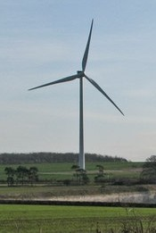
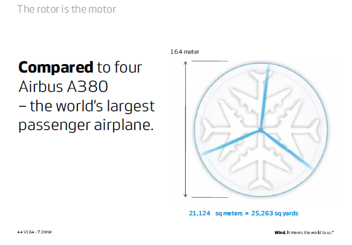

<!-- title: "Wind Turbines: aerodynamics and control" -->

## {data-background="wind.jpg"}

<h2>Wind Turbines: aerodynamics and control</h2>
Rick Lupton

:::: {.notes}
Title notes.
::::

# How do wind turbines produce power?

## Kinetic energy in the wind

A chunk of air has kinetic energy

$$ E = \frac{1}{2} m V^2 $$

Its mass is

$$ m = \rho A V T $$

So POWER is

$$ P = \frac{E}{T} = \frac{1}{2} \rho A V^3 $$

## Wind to electrical power

The wind behind the turbine is slower: less KE

The difference goes into the shaft and the generator.

$$ 
P_{\mathrm{shaft}} = P_{\mathrm{in}} - P_{\mathrm{out}} \\
= \frac{1}{2} \rho A \left( V_\mathrm{in}^3 - V_{\mathrm{out}}^3 \right)
$$

----

## Build your own wind turbine

5 minutes:

- Choose how many blades to use
- Design a shape for your blades
- Cut them out and fit to the hub

Then we'll test them!

----

## Why so many different kinds?

{height=400}
{height=400}
{height=400}

::: {.notes}
They're doing different jobs.

How do we maximise POWER?
:::

----

## The Lanchester-Betz limit

Actuator disk picture

$$ \text{Force } F = \text{Rate of change of momentum } \frac{d(mv)}{dt} $$

<!-- Question: how do we calculate power if we know the force? -->

\begin{align}
\mathrm{Work} W &= \mathrm{Force} F \times \mathrm{Distance} d \\
\mathrm{Power} W &= \mathrm{Force} F \times \mathrm{Velocity} V
\end{align}

If we can work out the force (thrust) on the rotor, we can calculate the power.

----

Actuator disk picture

\begin{align}
\text{Rate of change of momentum } \frac{d(mv)}{dt} &= \dot{m} \left( V_{\infty} - V_W \right) \\
&= \rho A V_D \left( V_{\infty} - V_W \right)
\end{align}

It turns out that:
\begin{align}
V_D &= (1 - a) V_{\infty} \\
V_W &= (1 - 2a) V_{\infty}
\end{align}

So
\begin{align}
F &= 2 \rho A V_{\infty}^2 a (1 - a) \\
P = F V_D &= 2 \rho A V_{\infty}^3 a (1 - a)^2
\end{align}

How much do we want to slow the air down for maximum power?

---- 

## The Lanchester-Betz limit

Graph of power vs a

$$ a = \frac{1}{3} $$

$$ C_P = \frac{P}{\frac{1}{2} \rho A V_{\infty}^3 } $$

$$ {C_P}_{\mathrm{max}} = \frac{16}{27} = 0.593 $$

# Actual wind turbines

## Aerofoils

In theory, we should slow down the wind by 1/3 to maximise power.

But how do we actually do this?

Picture of aerofoil: lift, drag

Interactive 3D view -> section -> drag pitch angle?

----

## Testing 2

----

## How big is a wind turbine?

----

----

----

----

# Controlling power & thrust

<!-- storm background photo -->

## Power curve

Cubic law

Too much -- cut off

How do we do this?

----

$2 \; W/m^2$

 

 <!-- .element height="200px" style="vertical-align: middle" -->

David MacKay 
*Sustainable Energy Without the Hot Air*

----

 <!-- .element height="600px" -->

----

----

